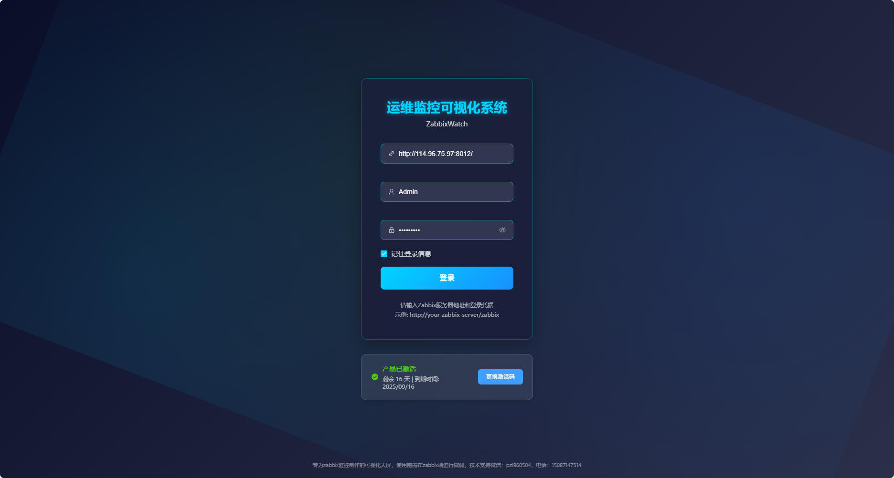
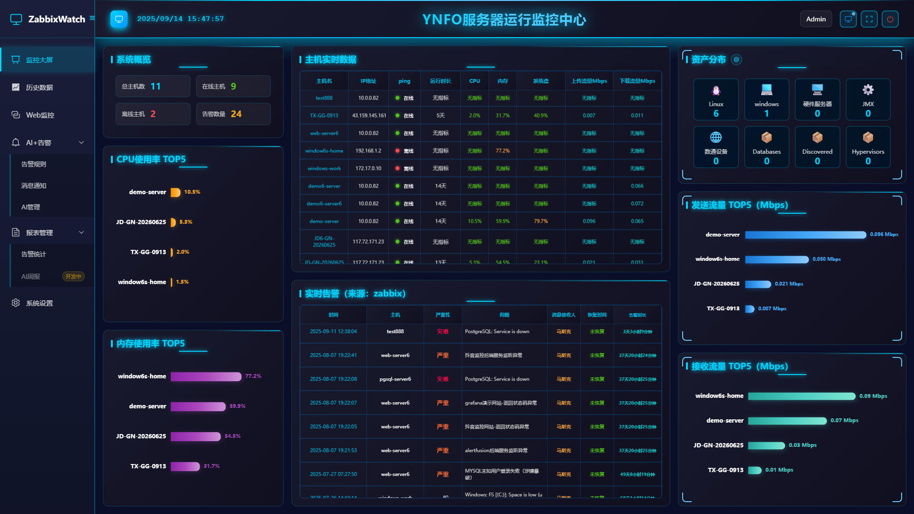
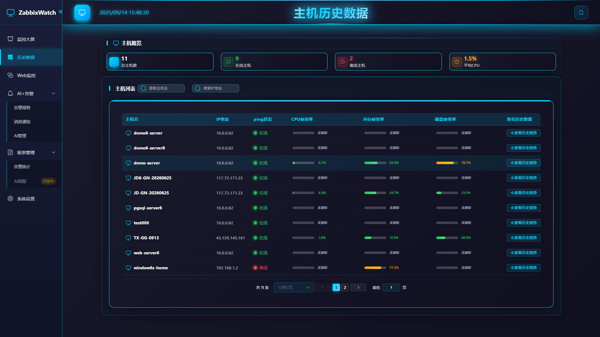
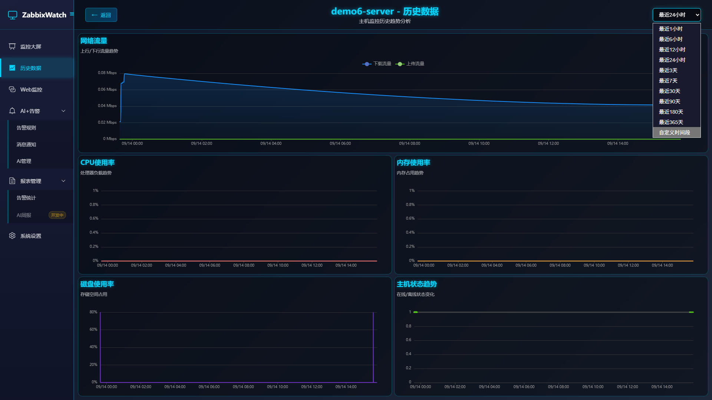
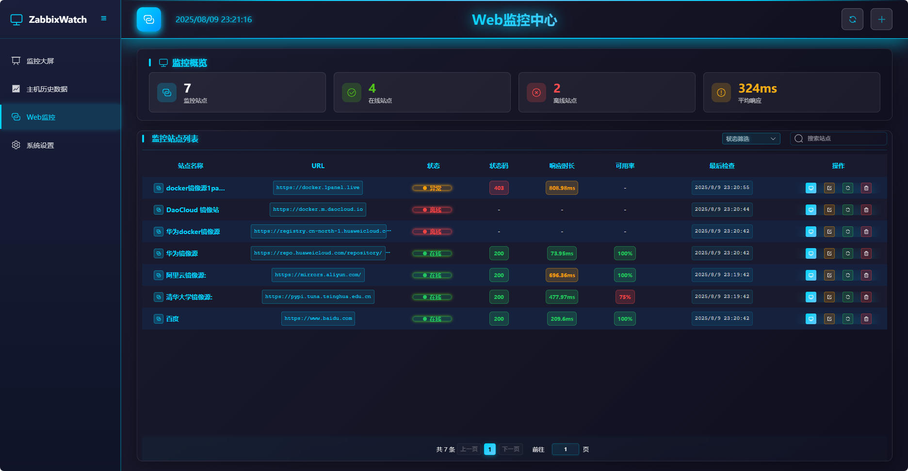
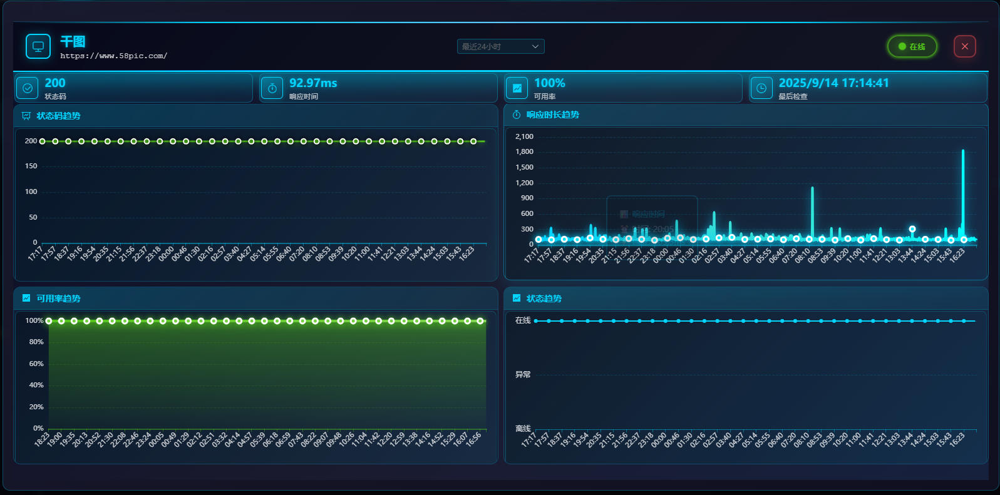
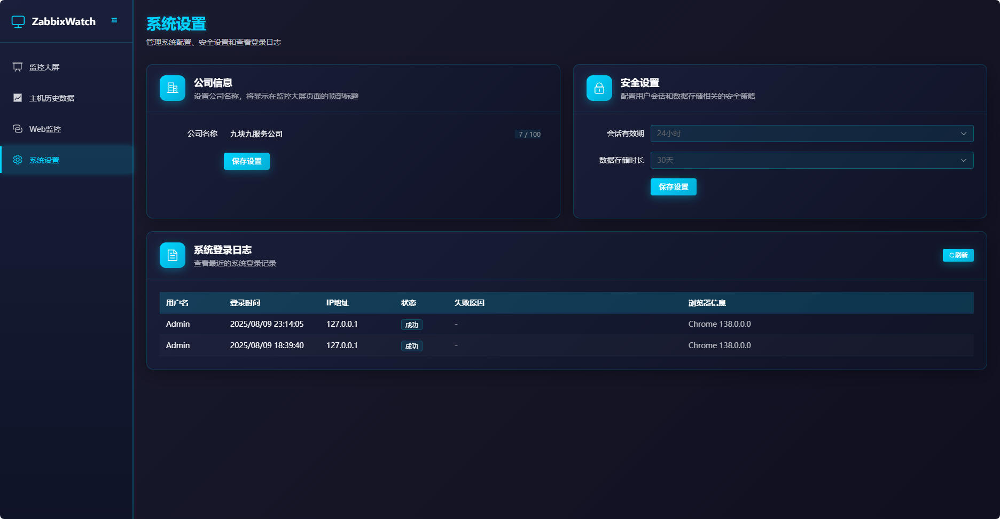

# ZabbixWatch - 监控可视化大屏

    

**一个现代化的 Zabbix 监控数据可视化大屏系统**

集成智能告警分析、Web站点监控、实时数据可视化的企业级监控解决方案

🔥 **核心亮点**: AI智能告警分析 | 多维度监控大屏 | Web站点监控 | 灵活告警规则

## 🎯 项目概述

ZabbixWatch 是一个基于 **VUE3 + Python + Flask + MySQL** 开发的 Zabbix 监控数据可视化平台。系统提供传统的监控大屏功能，集成了**智能告警系统**和**AI分析引擎**，为企业提供全方位的监控解决方案。

### 🚀 系统特色
- **🤖 AI智能分析**: 集成先进AI模型，对告警数据进行智能分析和优化建议
- **📊 可视化大屏**: 现代化设计，支持多种图表类型和自定义布局
- **🌐 Web监控**: 独立的Web站点监控模块，支持HTTP/HTTPS可用性检测
- **⚡ 实时告警**: 灵活的告警规则配置，支持多渠道通知和白名单管理
- **🔧 易于部署**: 支持Docker容器化部署，提供完整的K8s部署方案

image.png
## ✨ 核心功能

### 🖥️ 实时监控大屏
- **美观的可视化界面**: 现代化设计风格，支持深色主题
- **实时数据更新**: 自动刷新

### 📊 历史数据展示
- **主机监控**: CPU、内存、磁盘、网络等系统指标实时展示
- **告警管理**: 实时告警展示和历史告警统计
- **趋势分析**: 支持多时间维度的数据趋势图表

### 🚨 智能告警系统
- **告警规则配置**: 灵活的告警阈值设置，支持主机和Web监控告警
- **告警统计分析**: 完整的告警历史记录查询、筛选和统计功能
- **AI智能分析**: 集成AI模型对告警进行智能分析和建议
- **多渠道通知**: 支持多种消息通知方式（开发中）
- **白名单管理**: 支持主机白名单，避免误报告警

### 🌐 Web站点监控
- **HTTP/HTTPS监控**: 支持网站可用性和响应时间监控
- **多站点管理**: 批量添加和管理监控站点
- **性能分析**: 响应时间、状态码、可用率统计
- **告警集成**: Web监控异常自动触发告警通知

### ⚙️ 系统管理
- **公司信息**: 自定义公司名称
- **数据管理**: 自动数据清理和存储优化
- **登录日志**: 记录用户登录日志

## 🏗️ 技术架构

### 前端技术栈
- **Vue.js 3.x**: 现代化前端框架
- **Element Plus**: 企业级UI组件库
- **Apache ECharts**: 专业图表库
- **Vite**: 快速构建工具

### 后端技术栈
- **Flask**: 轻量级Python Web框架
- **MySQL**: 可靠的关系型数据库
- **JWT**: 安全的身份认证
- **异步处理**: 高性能数据采集和处理
- **告警引擎**: 自研告警规则引擎和AI分析模块
- **Zabbix API**: 与Zabbix系统集成

### 部署架构
- **容器化**: docker部署
- **微服务**: 模块化架构设计
- **负载均衡**: Nginx反向代理
- **高可用**: 支持集群部署

## 🚀 主要优势

### 🎨 用户体验
- **直观易用**: 无需复杂配置，zabbix服务器端配置简单，前端配置方便
- **美观现代**: 精心设计的UI界面
- **实时响应**: 近实时的数据更新

### 🤖 智能告警
- **AI驱动分析**: 集成AI模型对告警进行智能分析和建议
- **减少误报**: 支持主机白名单管理，避免误报告警
- **多渠道通知**: 支持多种告警通知方式，确保及时响应
- **完整统计**: 告警历史记录查询、筛选和趋势分析

### 💼 业务价值
- **降低运维成本**: 提高监控效率
- **提升响应速度**: 快速发现和定位问题
- **改善决策支持**: 直观的数据展示
- **增强团队协作**: 统一的监控视图

## 🔌 Zabbix集成

ZabbixWatch与Zabbix监控系统深度集成，通过标准API接口获取监控数据：

- **版本支持**: 支持Zabbix 7.0及以上版本
- **无缝对接**: 支持Zabbix标准API，需简单修改现有监控配置
- **实时同步**: 自动同步主机、监控项、告警等信息

> 💡 **配置提示**: 修改现有监控配置，具体配置方法请参考部署文档。

## 🎯 适用场景

### 企业监控中心
- 数据中心监控大屏
- NOC（网络运营中心）
- 运维团队日常监控

### 主机监控
- 主机CPU、内存、磁盘、网络等系统指标监控
- 主机性能趋势分析
- 主机告警管理

### 管理决策
- 高管仪表板
- 运营数据展示
- 性能报告展示

## 📈 版本规划

### 当前版本特性
- ✅ 基础监控大屏
- ✅ 实时数据展示
- ✅ Web站点监控
- ✅ 用户认证系统
- ✅ 容器化部署

### 未来版本规划
- 🔄 更多图表类型
- 🔄 添加告警管理

## 🤝 技术支持

提供完善的技术支持和文档：

- **部署指南**: 详细的安装和配置文档
- **故障排除**: 常见问题解决方案

