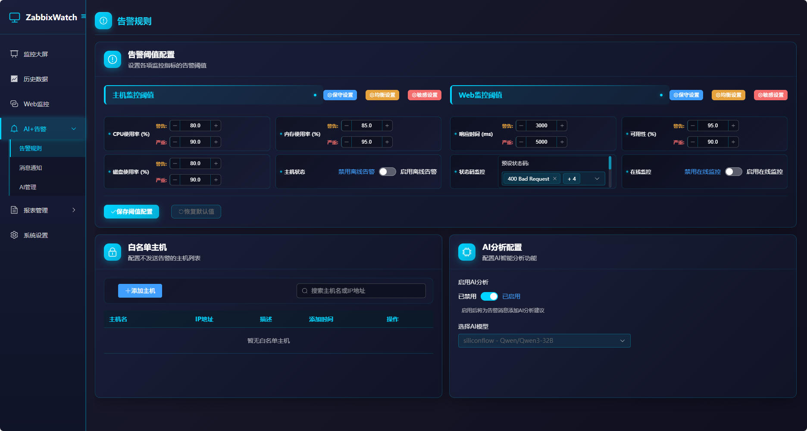
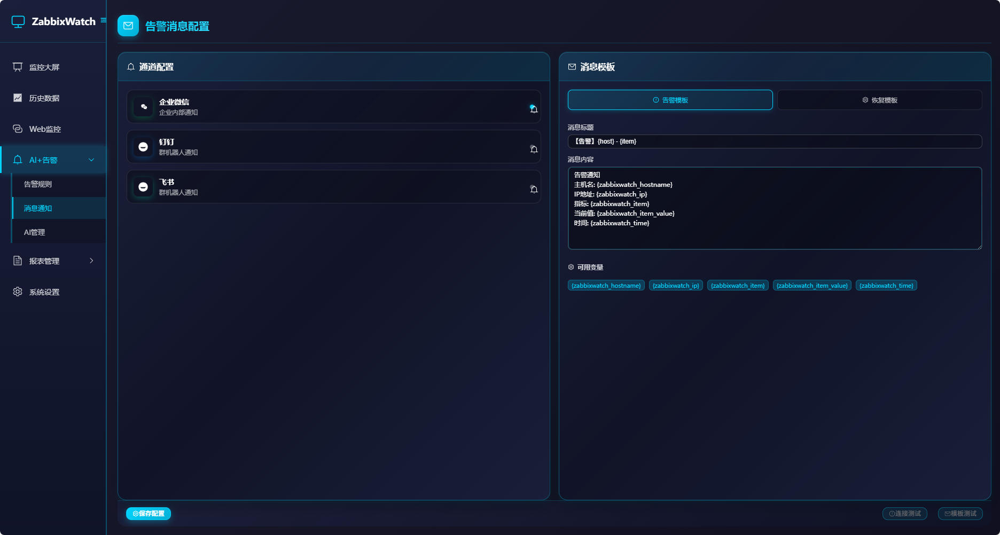
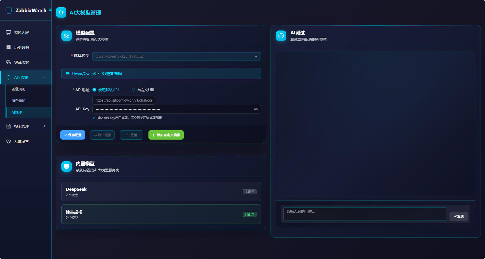
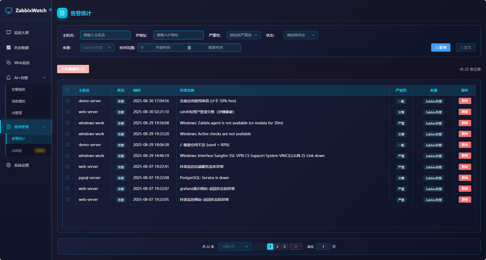
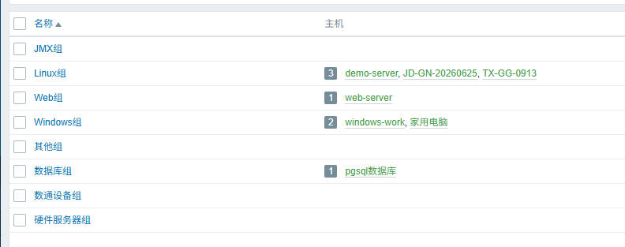
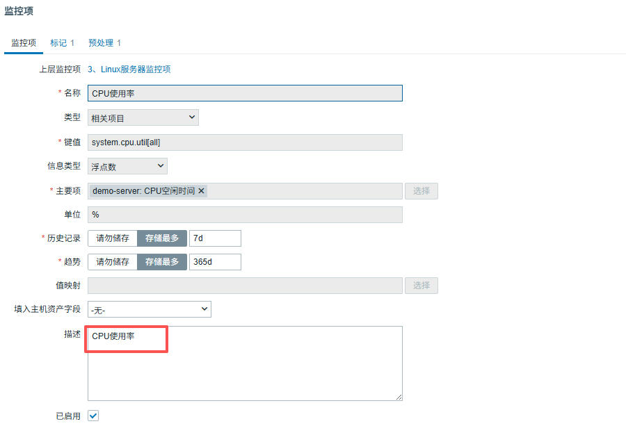

# ZabbixWatch - 监控可视化大屏

<div align="center">

    

**一个现代化的 Zabbix 监控数据可视化大屏系统**

集成智能告警分析、Web站点监控、实时数据可视化的监控解决方案

**核心亮点**: AI智能告警分析 | 多维度监控大屏 | Web站点监控 | 灵活告警规则

</div>


## 📋 项目概述

ZabbixWatch 是一个基于 **VUE3 + Python + Flask + MySQL** 开发的 Zabbix 监控数据可视化平台。系统提供传统的监控大屏功能，集成了**智能告警系统**和**AI分析引擎**，为企业提供全方位的监控解决方案。

作者： 微信pzl960504

### ✨ 系统特色
- **🤖 AI智能分析**: 集成先进AI模型，对告警数据进行智能分析和优化建议
- **📊 可视化大屏**: 现代化设计
- **🌐 Web监控**: 不依赖zabbix,独立的Web站点监控模块，支持HTTP/HTTPS可用性检测
- **⚡ 实时告警**: 灵活的告警规则配置，支持多渠道通知和白名单管理
- **🐳 易于部署**: 支持Docker容器化部署


## 🚀 核心功能

### 🖥️ 实时监控大屏
- **🎨 美观的可视化界面**: 现代化设计风格，支持深色主题
- **🔄 实时数据更新**: 自动刷新


### 📈 历史数据展示
- **💻 主机监控**: CPU、内存、磁盘、网络等系统指标实时展示
- **🚨 告警管理**: 实时告警展示和历史告警统计
- **📊 趋势分析**: 支持多时间维度的数据趋势图表


### 🔔 智能告警系统
- **⚙️ 告警规则配置**: 灵活的告警阈值设置，支持主机和Web监控告警
- **📋 告警统计分析**: 完整的告警历史记录查询、筛选和统计功能
- **🤖 AI智能分析**: 集成AI模型对告警进行智能分析和建议
- **📢 多渠道通知**: 支持多种消息通知方式（开发中）
- **🛡️ 白名单管理**: 支持主机白名单，避免误报告警






### 🌍 Web站点监控
- **🔍 HTTP/HTTPS监控**: 支持网站可用性和响应时间监控
- **📝 多站点管理**: 批量添加和管理监控站点
- **⚡ 性能分析**: 响应时间、状态码、可用率统计
- **🔗 告警集成**: Web监控异常自动触发告警通知


### 🛠️ 系统管理
- **🏢 公司信息**: 自定义公司名称
- **💾 数据管理**: 自动数据清理和存储优化
- **📝 登录日志**: 记录用户登录日志


## 💻 系统要求

### 🖥️ 硬件要求（建议部署在zabbix服务器上）
| 组件 | 最低配置 | 推荐配置 |
|------|----------|----------|
| CPU | 2核心 | 4核心+ |
| 内存 | 4GB| 6GB+ |
| 存储 | 20GB | 50GB+ |


### 📦 软件要求
- **操作系统**: Linux (X86_64)
- **Docker**: 20.10+ 
- **Docker Compose**: 2.0+
- **网络**: 能够访问Zabbix服务器
- **Python**: 3.8+ 
- **Zabbix**: 7.0+ (需要API访问权限)

### 🔌 端口要求
| 服务 | 端口 | 说明 |
|------|------|------|
| 前端 | 3000 | Web界面访问端口 |
| 后端API | 5000 | API服务端口 |
| 数据库 | 3306 | MySQL数据库端口 |
| Nginx | 8088 | 反向代理端口 |


## 🚀 docker部署
### 🔍 1. 环境检查

```bash
# 检查Docker版本
docker --version
docker-compose --version
```

### 📥 2. 获取部署包并部署

```bash
# 下载部署包
zabbixwatch-images-latest.tar.gz

# 解压部署包
tar -zxvf zabbixwatch-images-latest.tar.gz
cd zabbixwatch-images-latest
bash deploy.sh
```
### 🌍 3. 访问
前端访问：http://你的服务器ip:8088
账号密码：使用zabbix账号密码登录


## 🔗 Zabbix集成

ZabbixWatch与Zabbix监控系统深度集成，通过标准API接口获取监控数据：

- **版本支持**: 支持Zabbix 7.0及以上版本
- **无缝对接**: 支持Zabbix标准API，需简单修改现有监控配置
- **实时同步**: 自动同步主机、监控数据、告警等信息

#### 📂 1. 主机组配置（必须）
确保Zabbix中已创建以下主机组，系统将自动识别并统计各组主机数量：

| 主机组名称（必须） | 建议主机类型 |
|-----------|-------------|
| Linux组 | CentOS、Ubuntu、RHEL等 |
| Windows组 | Windows Server系列 |
| 数通设备组 | 支持SNMP的网络设备 |
| 数据库组 | MySQL、Oracle、SQL Server等 |
| Web服务器 | Apache、Nginx、IIS等 |
| JMX组 | Tomcat、WebLogic等 |
| 硬件服务器组 | 支持SNMP的硬件服务器 |
| 其他组 | 其他主机 |

**告警配置**: 为需要告警的主机组配置相应的触发器

#### ⚙️ 2. 监控项描述配置（必须）

确保监控项描述与系统要求一致，系统通过描述字段匹配监控数据：

| 监控指标（无需修改） | 监控项描述（需修改） | 数据累加说明 |
|---|---|---|
| CPU使用率相关监控项 | cpu使用率 | 多核CPU时会累加所有核心使用率 |
| 内存使用率相关监控项 | 内存使用率 | 多内存条时会累加总使用率 |
| 磁盘使用率相关监控项 | /:磁盘使用率<br>C:磁盘使用率 | 优先匹配/:磁盘使用率，无数据时尝试C:磁盘使用率 |
| 网络接收流量相关监控项 | 接收流量 | 多网卡时会累加所有网卡接收流量 |
| 网络发送流量相关监控项 | 发送流量 | 多网卡时会累加所有网卡发送流量 |
| 主机连通性相关监控项 | icmpping | 不累加，取单一连通状态值 |
| 系统运行时间相关监控项 | 正常运行时间 | 不累加，取单一运行时间值 |


## 📅 版本规划

### ✅ 当前版本特性
- 基础监控大屏
- 实时数据展示
- Web站点监控
- AI+告警

### 🔮 未来版本规划
- 更多图表类型


## 🤝 技术支持

提供完善的技术支持和文档


