<div align="center">

# ZabbixWatch
Zabbix 可视化监控大屏系统

实时监控 · 动态网络拓扑 · 主机配置管理 · ip扫描 · AI 智能分析

zabbix零配置接入 · 开箱即用 · 5分钟快速部署 · 系统支持中英文语言

</div>


## 项目简介

ZabbixWatch 是一个基于 Zabbix 的可视化监控大屏系统，专为运维团队打造。

网站：https://zabbixwatch.data-demo.cn

核心功能：

- 监控大屏：配置zabbix数据源后自动采集zabbix监控数据
- 网络拓扑：用户可以根据自己的环境自定义网络拓扑，动态展示实时流量及主机数据
- 历史数据：多维度展示主机历史数据
- web监控：不依赖于zabbix，可对常用的网站进行状态码等指标的监控
- AI+告警：用户可自定义告警规则、设置告警消息接收方式（飞书、钉钉、企业微信、邮件）、设置AI大模型进行辅助告警分析
- 报表统计：对告警信息进行统计
- 大屏制作：用户可自定义监控大屏并制作轮播图
- 系统设置：可自定义监控大屏的标题、会话有效期及数据存储时长
- 指标管理：自定义映射监控指标键值、过滤首页展示的主机
- 主机配置管理：可在zabbixwatch上管理被监控主机，包括添加、删除、编辑信息
- 告警语音播报：支持在系统页面中进行告警的语音播报（只要有告警就会播报，无论在任何页面）
- 网络扫描：支持扫描多个网段ip存活状态
- 多语言：系统支持中英文语言切换

适用场景：IT 运维监控、数据中心可视化、多机房统一监控、运维大屏展示

## 联系方式

- 作者微信: pzl960504
- GitHub: https://github.com/zlpu/zabbixwatch-demo
- Gitee: https://gitee.com/root-pu/zabbixwatch-demo
- Email: 2925006354@qq.com


## 版本历史
>v4及后续版本需要有偿提供，v3版免费不开源
>>付费方式：https://item.taobao.com/item.htm?ft=t&id=1012720700836

### v5.2.4 (2026-02-20) - 当前版本

新功能：
- 网络扫描：支持扫描多个网段ip存活状态
- 多语言：系统支持中英文语言切换

### v5 (2026-02) 

- 主机配置管理：可在zabbixwatch上管理被监控主机，包括添加、删除、编辑信息
- 告警语音播报：支持在系统页面中进行告警的语音播报（只要有告警就会播报，无论在任何页面）
- 新增邮件告警方式
- 优化前端数据加载性能，减少客户端资源消耗

### v4 (2026-01-18)

更新：

- 支持自定义监控指标键值：用户自行维护指标键值映射关系
- 支持过滤首页展示的主机：可自定义需要在首页展示的主机
- 新增网络拓扑功能：用户可以根据自己的环境自定义网络拓扑，动态展示实时流量及主机数据
- 数据库切换为mariadb：解决mysql8适配问题
### v3.0 (2025-12-02)

主要更新：

- 地图告警：大屏新增地图样式告警展示
- 可见名称：全面支持 Zabbix 主机可见名称
- 流程优化：取消数据初始化页面，解决认证失败
- 规则持久化：告警规则配置持久化存储
- 时间筛选：告警信息支持时间范围查询
- 状态判断：在线/离线增加双重判断标准
- 磁盘显示：修复磁盘使用率显示问题

### v2.0 (2025-11-04)

主要更新：

- 零配置接入：直接接入 Zabbix
- 自定义大屏：拖拽式编辑器
- 多数据源：支持多个 Zabbix
- AI 增强：内置大模型
- 大屏优化：流量 TOP10
- 架构重构：模块化设计

### v1.1 (2025-09-14)

功能增强：

- 扩展 Zabbix 版本支持（5.x/6.x/7.x）
- 自定义资产组显示
- 自定义时间段查询
- 简化 Zabbix 配置
- Docker Compose 部署

### v1.0 (2025-08-29)

首次发布：

- 基础监控大屏
- 历史数据趋势图
- Web 站点监控
- AI + 告警分析
- Webhook 消息通知
- 容器化部署


## 使用教程
#### 1. 首次登录

访问地址: http://your-server:8088
默认账号: Admin / watch

注意：首次登录后请立即修改密码

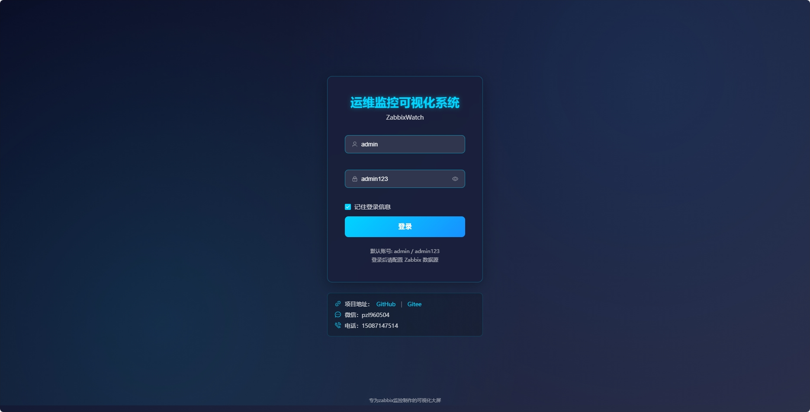

#### 2. 配置 Zabbix 数据源

操作路径：右上角系统设置 → 数据源配置

配置信息：
- Zabbix URL: http://your-zabbix-server
- 用户名: Admin（使用实际的账号密码）
- 密码: zabbix

点击测试连接，确认连接成功后保存配置。

零配置说明：无需在 Zabbix 端做任何修改，直接配置即可使用。

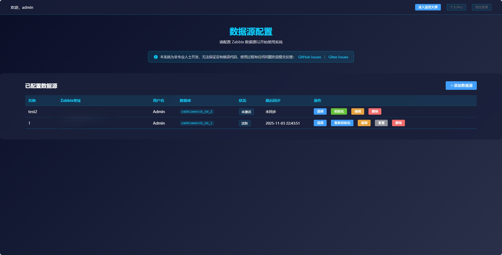

#### 3. 查看监控大屏

操作路径：左侧菜单 → 监控大屏

功能说明：
- 自动加载数据，实时刷新
- 支持自定义资产组显示
- 支持全屏展示（F11 全屏 / ESC 退出）
- 地图告警展示

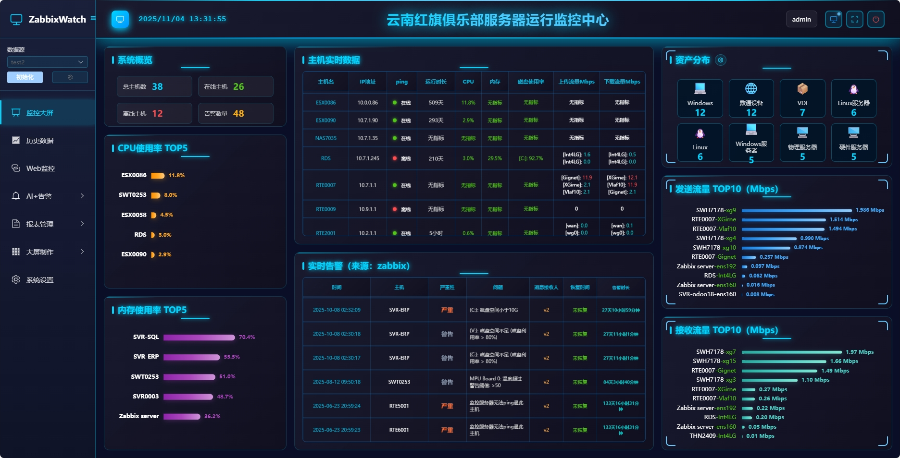
操作: 左侧菜单 → 监控大屏-网络拓扑图

功能: 自定义网络拓扑图-关联主机实时数据


支持英文：


#### 4. 查看历史数据

操作路径：左侧菜单 → 历史数据

功能说明：
- 自定义时间段查询（精确到分钟）
- 多指标对比分析
- 支持数据导出

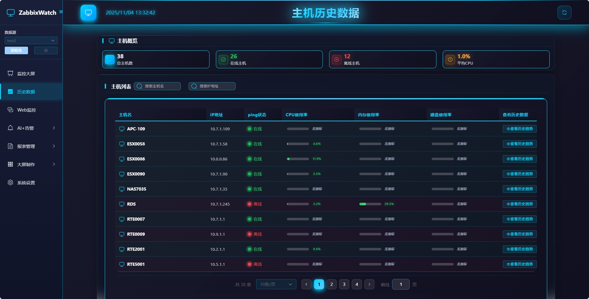
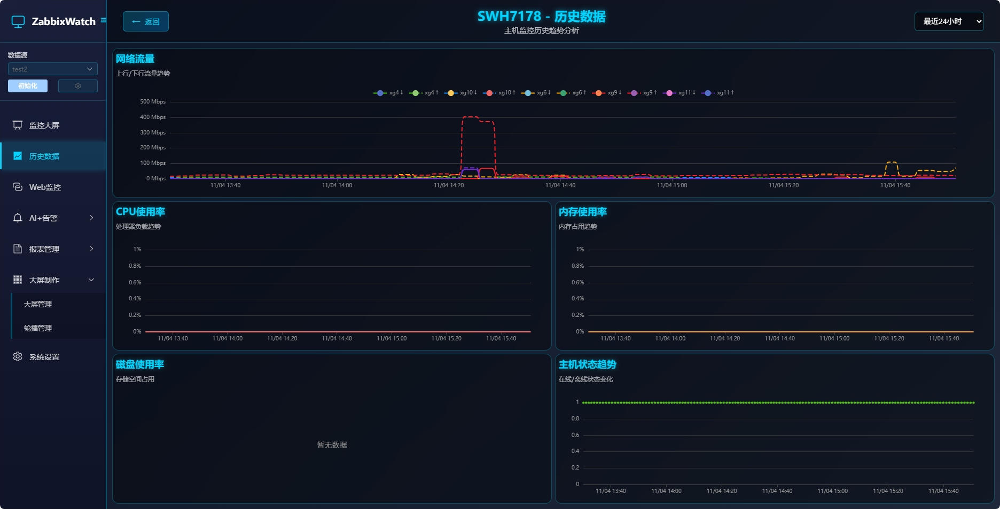

#### 5. Web 监控

操作路径：左侧菜单 → Web 监控

功能说明：
- 实时监控站点状态
- 响应时间分析
- 可用性统计

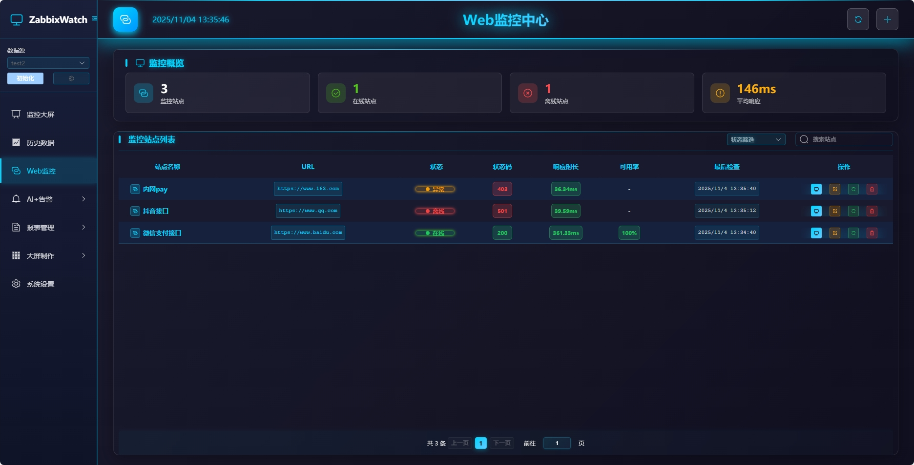

#### 6. 配置告警规则和 AI 模型

操作路径：左侧菜单 → AI+告警

告警规则配置：
- 主机告警规则
- Web 站点告警规则
- 自定义告警阈值和时间窗口

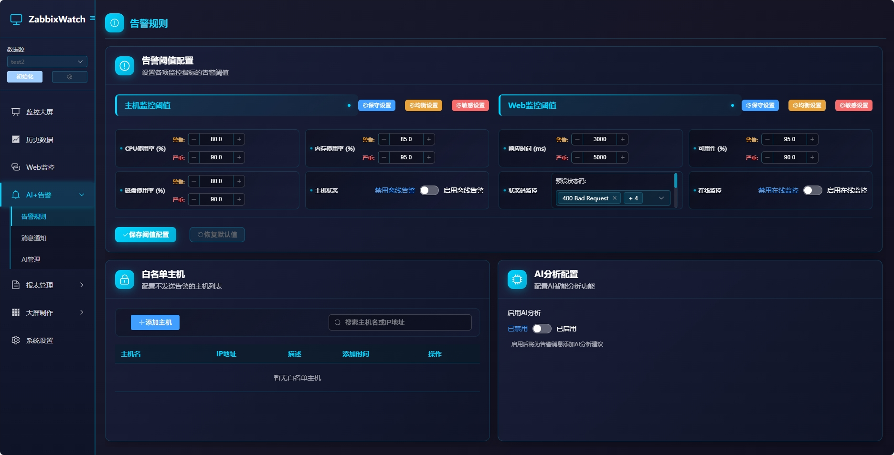

消息配置：
- 支持微信、飞书、钉钉、邮件
- 自定义消息模板

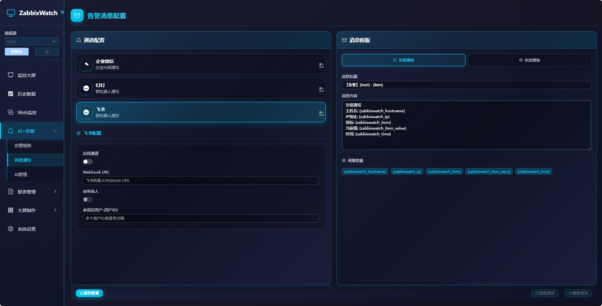

AI 模型配置：
- 内置服务商：硅基流动、DeepSeek、OpenAI
- 支持自定义模型 API 地址和 Key

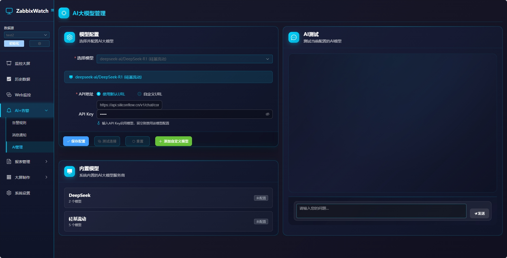

#### 7. 制作自定义大屏

操作路径：左侧菜单 → 制作大屏 → 新建

操作流程：
1. 拖拽组件到画布
2. 调整布局和大小
3. 配置数据源
4. 设置背景和样式
5. 预览效果
6. 保存大屏
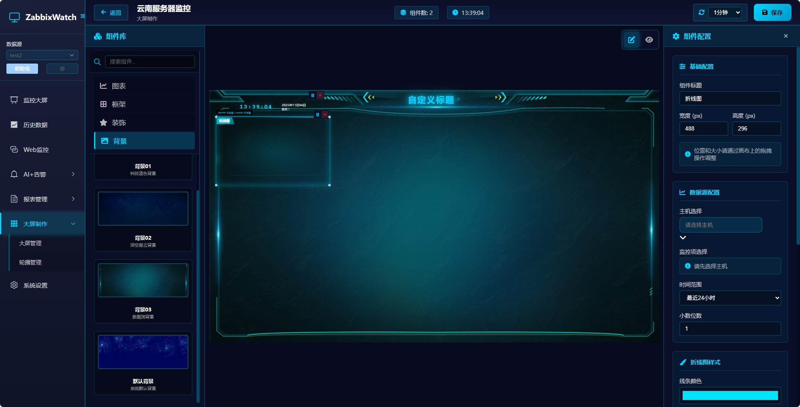
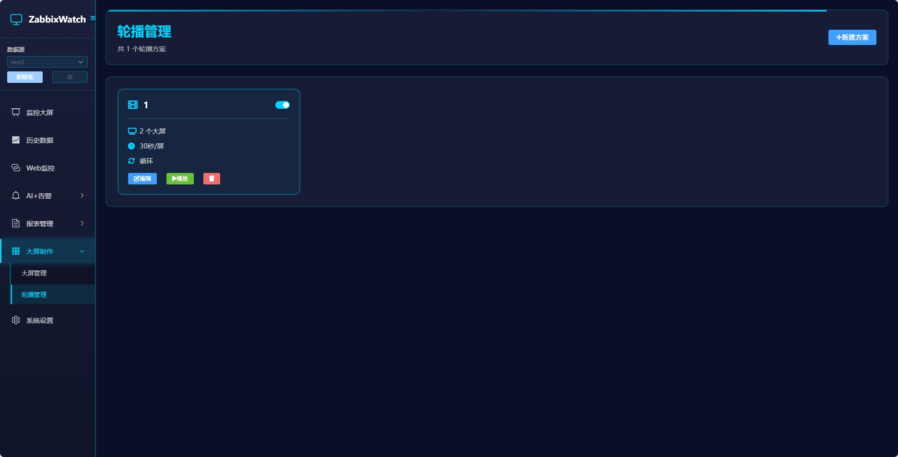

#### 8. 指标管理（v4 新增）
操作路径：系统设置 → 指标管理(主机过滤)

功能说明：
- 监控指标键值映射管理
- 首页主机过滤


#### 9. 系统设置

操作路径：左侧菜单 → 系统设置

功能说明：
- 定义首页大屏标题
- 设置会话有效期
- 配置数据存储时长
- 手动清理数据
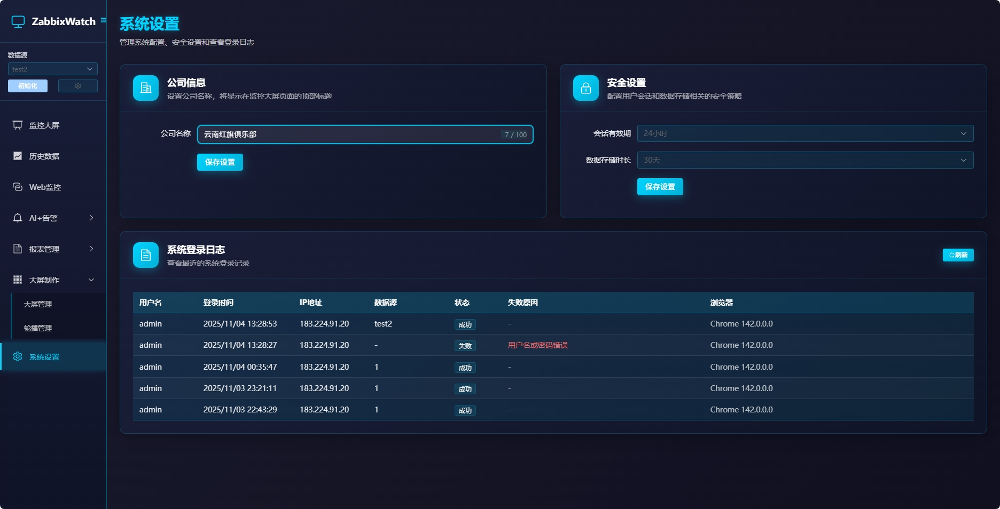

#### 10. 语音播报

操作路径：左侧菜单 → 系统设置

功能说明：
- 支持告警语音播报，可设置声音属性


#### 11. 主机配置管理
- 可在zabbixwatch上管理被监控主机，包括添加、删除、编辑信息


#### 12. 网络扫描
- 定义多个局域网网段，扫描网络ip存活状态


## 部署教程

### 环境要求

- Docker 20.10+
- Docker Compose 1.29+
- Zabbix Server 5.0+


### 一、新系统搭建

#### 1. 安装 Docker 环境

如果系统未安装 Docker，执行以下命令一键安装：

```bash
# Linux 系统一键安装 Docker
bash <(curl -sSL https://linuxmirrors.cn/docker.sh)
# 验证安装
docker --version
docker-compose --version
```
Windows 系统请访问 Docker 官网下载 Docker Desktop：https://www.docker.com/products/docker-desktop

#### 2. 下载项目文件
```bash
# 从 GitHub 下载
git clone https://github.com/zlpu/zabbixwatch-demo.git
# 或从 Gitee 下载（国内推荐）
git clone https://gitee.com/root-pu/zabbixwatch-demo.git
# 进入项目目录
cd zabbixwatch-demo/Install-zabbixwatch/docker-compose
```
#### 3. 启动服务

```bash
# 启动所有服务
docker-compose up -d
# 查看服务状态
docker-compose ps
# 查看启动日志
docker-compose logs -f
```
等待所有服务启动完成（约 1-2 分钟），看到类似以下输出表示成功：

```
zabbixwatch-web      ... Up      0.0.0.0:8088->80/tcp
zabbixwatch-backend  ... Up      5000/tcp
zabbixwatch-mysql    ... Up      3306/tcp
```

#### 4. 访问系统

浏览器访问：http://your-server-ip:8088

默认账号：admin / admin123

首次登录后请立即修改密码。

#### 5. 配置 Zabbix 数据源

登录后进入系统设置 → 数据源配置，添加您的 Zabbix 服务器信息。

### 二、版本更新

#### 方式一：保留数据更新（推荐）

适用于需要保留历史数据和配置的场景。

```bash
# 1. 进入项目目录
cd zabbixwatch-demo/Install-zabbixwatch/docker-compose
# 2. 拉取最新代码
git pull
# 3. 拉取最新镜像
docker-compose pull
# 4. 停止旧服务（不删除数据）
docker-compose stop
# 5. 启动新版本
docker-compose up -d
# 6. 查看更新日志
docker-compose logs -f
```

数据库和配置文件会自动保留，无需重新配置。

#### 方式二：全新安装更新

适用于需要清空所有数据重新开始的场景。

```bash
# 1. 进入项目目录
cd zabbixwatch-demo/Install-zabbixwatch/docker-compose
# 2. 停止并删除所有容器和数据
docker-compose down -v
# 3. 拉取最新代码
git pull
# 4. 启动新版本
docker-compose up -d
```

注意：此方式会删除所有数据，包括用户配置、大屏配置、告警规则等。

#### 更新后验证

```bash
# 检查服务状态
docker-compose ps
# 访问前端页面
# 浏览器打开: http://your-server:8088
```

建议更新后清除浏览器缓存，避免前端资源缓存导致的问题。

### 三、系统卸载

#### 完全卸载（删除所有数据）

```bash
# 1. 进入项目目录
cd zabbixwatch-demo/Install-zabbixwatch/docker-compose

# 2. 停止并删除容器、网络、数据卷
docker-compose down -v

# 3. 删除镜像（可选）
docker rmi $(docker images | grep zabbixwatch | awk '{print $3}')

# 4. 删除项目文件（可选）
cd ../../..
rm -rf zabbixwatch-demo
```

#### 仅停止服务（保留数据）

```bash
# 停止服务但保留数据
docker-compose stop

# 或者停止并删除容器但保留数据卷
docker-compose down
```

### 常见部署问题

#### 问题 1：端口被占用

错误信息：Bind for 0.0.0.0:8088 failed: port is already allocated

解决方法：
```bash
# 查看端口占用
netstat -tunlp | grep 8088

# 修改 docker-compose.yml 中的端口
ports:
  - "8080:80"  # 改为其他未占用端口
```

#### 问题 2：容器启动失败

错误信息：Container exited with code 1

解决方法：
```bash
# 查看详细日志
docker compose logs -f
```

#### 问题 3：进入监控大屏闪退

解决方法：
- 若重启了服务器，需重新初始化zabbix数据源
- 长时间未操作系统，发生闪退现象，需要点击退出登录后重新登录

#### 问题 4：无法连接 Zabbix 服务器？

检查以下几点：
- Zabbix URL 是否正确（不需要包含 /api_jsonrpc.php）
- Zabbix 用户名和密码是否正确
- 网络是否连通（可以在容器内 ping Zabbix 服务器）
- Zabbix API 版本是否兼容（支持 5.0+）

#### 问题 5：大屏卡顿？

解决方法：
- 更新v4版本

## 贡献与支持

### 问题反馈

在 GitHub Issues 页面提交问题：https://github.com/zlpu/zabbixwatch-demo/issues

提交问题时请包含：
- 问题描述
- 复现步骤
- 系统环境（操作系统、Docker 版本等）
- 错误日志

### 技术支持

- 作者微信: pzl960504
- Email: 2925006354@qq.com

## 致谢

感谢以下开源项目：

- [Zabbix](https://www.zabbix.com/) - 企业级监控解决方案
- [Vue.js](https://vuejs.org/) - 渐进式 JavaScript 框架
- [Flask](https://flask.palletsprojects.com/) - Python Web 框架
- [ECharts](https://echarts.apache.org/) - 数据可视化图表库

<br>

## ⭐️ Star History

如果这个项目对你有帮助，请给我们一个 Star ⭐️

[](https://star-history.com/#zlpu/zabbixwatch-demo&Date)

<br>


<div>

### 🌟 如果觉得项目不错，请给个 Star ⭐️

<table>
<tr>
<td align="center" width="50%">
<a href="https://github.com/zlpu/zabbixwatch-demo">

<br>
<b>GitHub 仓库</b>
</a>
</td>
<td align="center" width="50%">
<a href="https://gitee.com/root-pu/zabbixwatch-demo">

<br>
<b>Gitee 仓库</b>
</a>
</td>
</tr>
</table>


<sub>Made with ❤️ by **pzl960504** | Copyright © 2025 ZabbixWatch. All rights reserved.</sub>

**[⬆️ 回到顶部](#-zabbixwatch)**

</div>
