# ZabbixWatch - 运维监控可视化大屏

<div align="center">

    
</div>


## 📋 项目概述

ZabbixWatch 是一个基于 Zabbix 监控数据的可视化平台,系统提供传统的监控大屏功能，集成了**智能告警系统**和**AI分析引擎**，提供通用的运维监控解决方案。

**核心亮点**:  zabbix监控大屏 | Web站点监控 | 灵活告警规则|AI智能告警分析


## 📈 版本历史

### 🆕 ZabbixWatch v1.1 `2025-09-14`(当前版本)
- 💚 扩展Zabbix版本支持（5.x、6.x、7.x）
- 💚 基础监控大屏-自定义资产组显示
- ✅ 基础监控大屏-实时数据展示
- 💚  历史数据趋势图 - [支持自定义时间段查询]
- ✅ Web站点监控（不依赖zabbix）
- ✅ AI+告警（告警规则+AI分析+webhook消息配置[企业微信、飞书、钉钉]）
- ✅ 容器化部署
- 💚 zabbix只需要配置监控项的描述字段，不再需要调整主机群组


### ZabbixWatch v1.0 `2025-08-29`
- ✅ 基础监控大屏-实时数据展示
- ✅ 历史数据趋势图 - [预设时间范围查询]
- ✅ Web站点监控（不依赖zabbix）
- ✅ AI+告警（告警规则+AI分析+webhook消息配置[企业微信、飞书、钉钉]）
- ✅ 容器化部署
- ✅ 仅支持Zabbix 7.x版本
- ✅ zabbix需配置主机群组、监控项描述字段

## 🔄 版本功能对比

| 功能特性 | ZabbixWatch v1.0 | ZabbixWatch v1.1 | 改进说明 |
|---------|------------------|------------------|----------|
| **Zabbix版本支持** | 仅支持 7.x | 支持 5.x、6.x、7.x | 扩展兼容性，支持更多企业环境 |
| **监控大屏** | 基础监控指标实时大屏（固定显示资产组） | 基础监控指标实时大屏（支持自定义显示资产组） | 支持自定义显示资产组 |
| **历史数据时间查询** | 预设时间范围（1小时-30天） | 支持自定义时间段 | 增强查询灵活性，满足精确分析需求 |
| **AI+告警** | ✅ 完整支持 | ✅ 完整支持 | 保持稳定 |
| **Web站点监控** | ✅ 完整支持 | ✅ 完整支持 | 保持稳定 |


### ✨ 系统功能


**📊 可视化大屏**: 基础监控指标实时大屏

**📈 历史数据展示**： 支持自定义时间范围查询历史数据

**🌐 Web监控**: 独立的Web站点监控模块，支持HTTP/HTTPS可用性检测

**⚡ 实时告警**: 灵活的告警规则配置，支持多渠道通知（企业微信、飞书、钉钉）和白名单管理

**🤖 AI智能分析**: 集成先进AI模型，对告警数据进行智能分析和优化建议

**🔧 易于部署**: 支持Docker容器化部署


## 🚀 功能介绍

### 🖥️ 实时监控大屏
- **美观的可视化界面**: 现代化设计风格，支持深色主题
- **实时数据更新**: 自动刷新
- **自定义资产组**: 支持自定义显示资产组信息，灵活配置监控范围

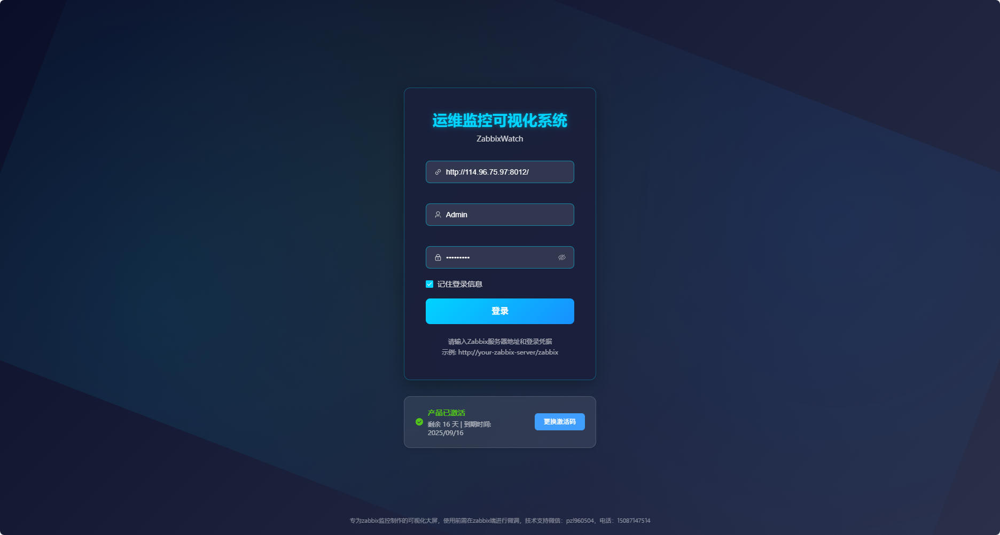
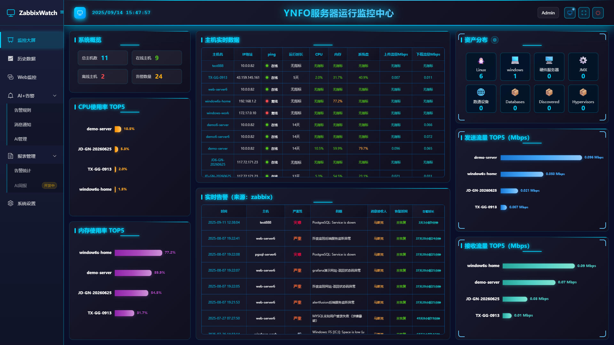

### 📈 历史数据展示
- **主机监控**: CPU、内存、磁盘、网络等系统指标实时展示
- **告警管理**: 实时告警展示和历史告警统计
- **趋势分析**: 支持多时间维度的数据趋势图表
- **自定义时间段**: 支持用户自定义时间范围查询历史数据

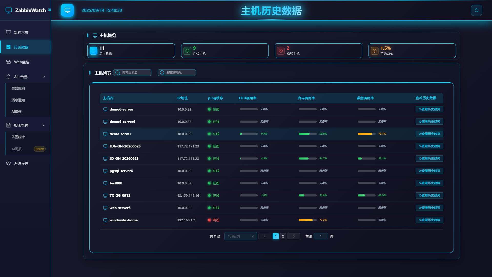
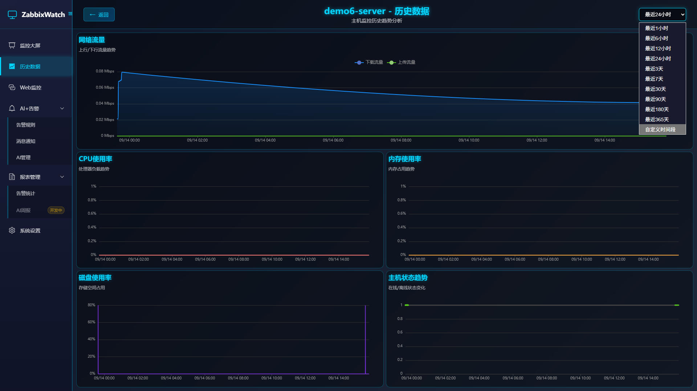

### 🔔 智能告警系统
- **告警规则配置**: 灵活的告警阈值设置，支持主机和Web监控告警
- **告警统计分析**: 完整的告警历史记录查询、筛选和统计功能
- **AI智能分析**: 集成AI模型对告警进行智能分析和建议
- **多渠道通知**: 支持多种消息通知方式（开发中）
- **白名单管理**: 支持主机白名单，避免误报告警

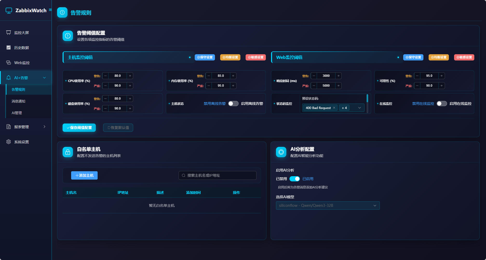
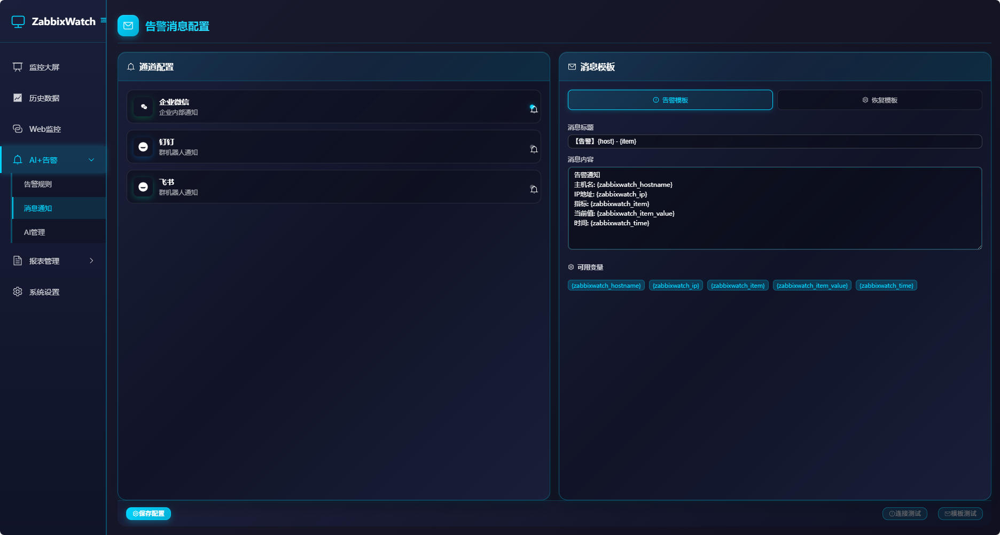
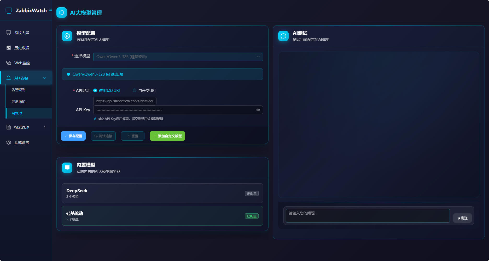
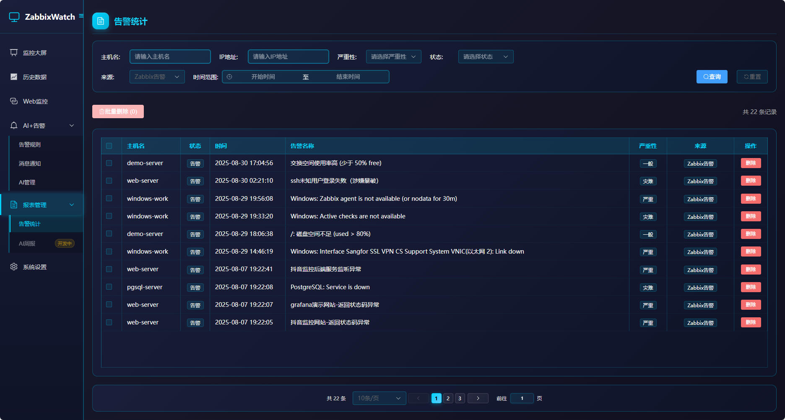

### 🌍 Web站点监控
- **HTTP/HTTPS监控**: 支持网站可用性和响应时间监控
- **多站点管理**: 批量添加和管理监控站点
- **性能分析**: 响应时间、状态码、可用率统计
- **告警集成**: Web监控异常自动触发告警通知

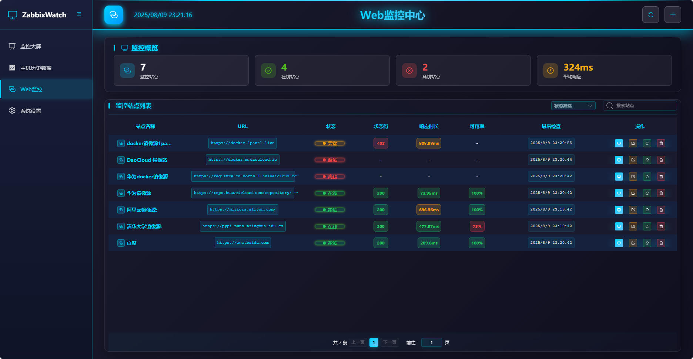
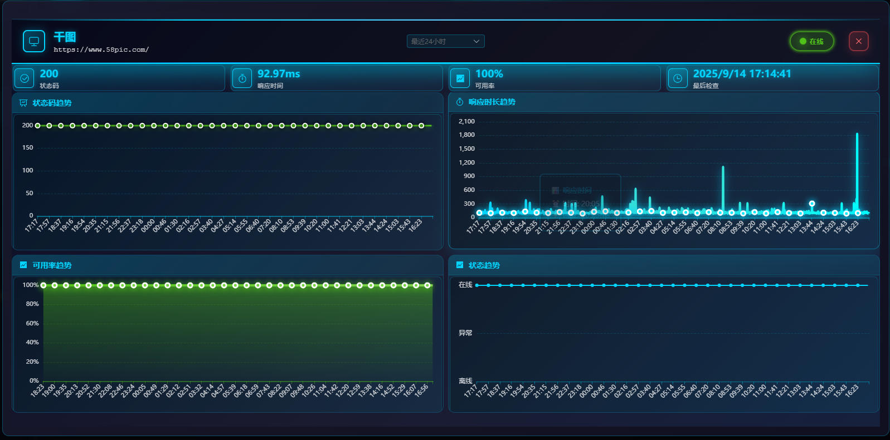

### 🛠️ 系统管理
- **公司信息**: 自定义公司名称
- **数据管理**: 自动数据清理和存储优化
- **登录日志**: 记录用户登录日志

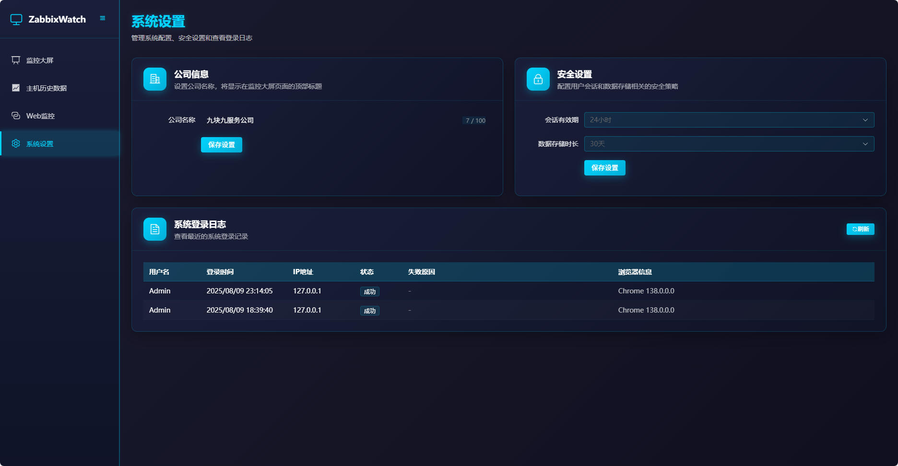

## 💻 系统要求

### 🖥️ 硬件要求（建议部署在zabbix服务器上）
| 组件 | 最低配置 | 推荐配置 |
|------|----------|----------|
| CPU | 2核心 | 4核心+ |
| 内存 | 4GB| 6GB+ |
| 存储 | 20GB | 50GB+ |


### 📦 软件要求
- **操作系统**: Linux (X86_64)
- **Docker、Docker Compose**: 若未安装，可使用下面的脚本联网一键安装，若已安装请忽略。
```
bash <(curl -sSL https://linuxmirrors.cn/docker.sh)
```
- **网络**: 能够访问Zabbix服务器


### 🔌 端口要求
| 服务 | 端口 | 说明 |
|------|------|------|
| Nginx | 8088 | 外部访问端口 |


## 🚀 docker部署
### 🔍 1. 环境检查

```bash
# 检查Docker版本
docker --version
docker-compose --version 或 docker compose version
```

### 📥 2. zabbixwatch部署
#### 第一次部署或重新部署
```bash
# 克隆项目
git clone https://gitee.com/root-pu/zabbixwatch--demo.git
# 进入项目目录
cd zabbixwatch--demo
bash deploy.sh
```
#### 🔄 升级部署

**重要说明**: 从 v1.1 版本开始，不再提供离线镜像包，改为在线拉取最新镜像部署。

```bash
# 1. 进入项目目录
cd zabbixwatch-demo

# 2. 停止当前服务（保留数据）
docker compose -f docker-compose/docker-compose.registry.yml down
或
docker-compose -f docker-compose/docker-compose.registry.yml down

# 3. 清理旧镜像
docker rmi registry.cn-chengdu.aliyuncs.com/pzl_devops/zabbix-watch-web:latest registry.cn-chengdu.aliyuncs.com/pzl_devops/zabbix-watch-api-en:latest
docker image prune -f

# 4. 启动升级后的服务
bash deploy.sh
```

**升级注意事项**:
- ✅ 数据库数据会自动保留（使用 Docker 卷存储）
- ✅ 配置文件会自动保留
- ✅ 日志文件会自动保留
- ⚠️ 如遇到镜像拉取失败，请检查网络连接或稍后重试
- ⚠️ 升级过程中服务会短暂中断（约1-2分钟）

### 🌍 3. 访问
前端访问：http://你的服务器ip:8088
账号密码：使用自己的zabbix账号密码登录（注意要使用有管理员权限的账号）


## 🔗 Zabbix集成

ZabbixWatch与Zabbix监控系统深度集成，通过标准API接口获取监控数据：
- **版本支持**: 支持Zabbix 5.x、6.x、7.x版本
- **无缝对接**: 支持Zabbix标准API，需简单修改现有监控配置
- **实时同步**: 自动同步主机、监控项、告警等信息


#### ⚙️监控项描述配置（必须）

确保监控项描述与系统要求一致，系统通过描述字段匹配监控数据：
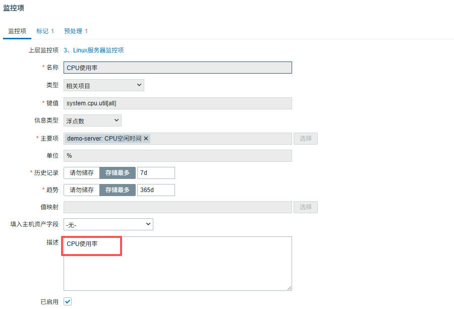
| 监控指标（无需修改） | 监控项描述（需修改） | 数据累加说明 |
|---|---|---|
| CPU使用率相关监控项 | cpu使用率 | 多核CPU时会累加所有核心使用率 |
| 内存使用率相关监控项 | 内存使用率 | 多内存条时会累加总使用率 |
| 磁盘使用率相关监控项 | /:磁盘使用率<br>C:磁盘使用率 | 优先匹配/:磁盘使用率，无数据时尝试C:磁盘使用率 |
| 网络接收流量相关监控项 | 接收流量 | 多网卡时会累加所有网卡接收流量 |
| 网络发送流量相关监控项 | 发送流量 | 多网卡时会累加所有网卡发送流量 |
| 主机连通性相关监控项 | icmpping | 不累加，取单一连通状态值 |
| 系统运行时间相关监控项 | 正常运行时间 | 不累加，取单一运行时间值 |


## 📅 版本规划

### ✅ 当前版本特性
- 基础监控大屏
- 实时数据展示
- Web站点监控
- AI+告警

### 🔮 未来版本规划
- 更多图表类型


## 🤝 技术支持

提供完善的技术支持和文档


